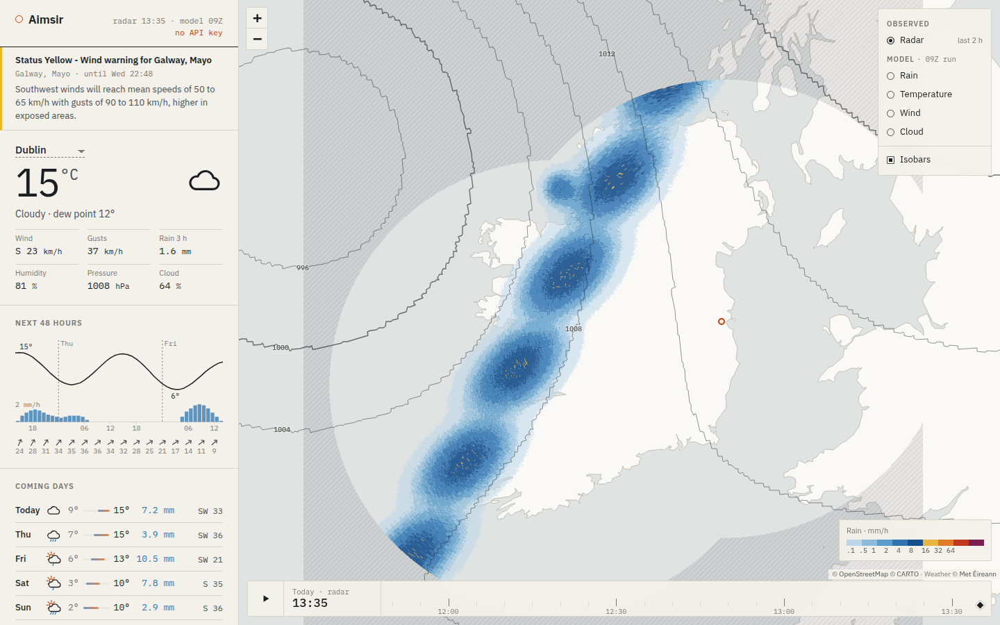

# Aimsir

A small self-hosted weather viewer for Ireland built on Met Éireann open data:

- **Radar**: the last 2 hours of Dublin + Shannon radar, composited and looped over a map.
- **Model**: HARMONIE-AROME NWP fields (rain, temperature, wind with arrows, cloud) and MSLP isobars, hour by hour for the latest run. Click the map to see the model's values for that spot.
- **More layers** (tucked under a collapsible menu): radar rainfall totals for each past hour (Met's hourly Dublin+Shannon composite), plus model wind gusts, lightning, visibility/fog and lying snow.
- **Point forecast**: current conditions, a 48-hour meteogram and a daily outlook for any location (Met's WDB point-forecast API).
- **Warnings**: current Met Éireann warnings shown at the top of the sidebar.

One Python process (FastAPI) polls Met's servers, decodes the raw files (HDF5 radar volumes, GRIB model output), renders transparent PNG overlays to disk and serves a plain HTML/JS frontend. It has no build step, no database, and the fonts and Leaflet are bundled locally.


*(Screenshot uses the bundled synthetic test data, not real weather.)*

---

## 1. Get an API key

Radar and NWP come from the new open data portal, which needs a free key:

1. Register at <https://opendata.met.ie> and verify your email.
2. Open your **Profile** page and copy the API key.

The point forecast and warnings feeds don't need a key.

## 2a. Run with Docker

```bash
cp .env.example .env        # paste MET_API_KEY, set HOME_* to your location
docker compose up -d --build
```

Open `http://<host>:8080`. Everything the app keeps is under `./data`.

## 2b. Run in a Proxmox LXC (no Docker)

On a Debian 12 / Ubuntu 22.04+ container, as root:

```bash
apt update && apt install -y git
git clone https://github.com/ryano365/aimsir.git /opt/aimsir
bash /opt/aimsir/deploy/install.sh
nano /opt/aimsir/.env          # paste MET_API_KEY, set HOME_*
systemctl restart aimsir
```

The installer sets up a virtualenv, a `aimsir` service user and a systemd unit on port 8080 (`PORT=9000 bash deploy/install.sh` to change it). All Python dependencies, including ecCodes for GRIB, come as pip wheels, so no extra system libraries are needed. A 1 vCPU / 1 GB / 8 GB container is plenty for radar; give it more disk if you keep a wide `NWP_FILE_REGEX`.

**Updating** later is the same script: it runs `git pull`, refreshes dependencies and restarts the service.

```bash
bash /opt/aimsir/deploy/install.sh
```

### Behind a reverse proxy

It's plain HTTP on port 8080, so point Nginx Proxy Manager, Caddy or Traefik at it. Nothing needs websockets. If you expose it publicly, put auth in front: `/api/debug/*` has no protection.

## 3. First run checklist

Met documents the portal API only loosely (see *What I couldn't verify* below), so check the first run:

| Check | How |
|---|---|
| Key works | `curl localhost:8080/api/status`: `error` should be `null` for both feeds |
| Radar files are listed | `curl localhost:8080/api/debug/list/radar?hours=1` |
| NWP files are listed | `curl localhost:8080/api/debug/list/nwp?hours=3` (summarised by name pattern; add `&full=true` for everything) |
| Hourly radar file layout | `curl localhost:8080/api/debug/radar?kind=acc` |
| Logs | `docker logs -f aimsir` / `journalctl -u aimsir -f` |

**Model downloads.** Met's near-realtime feed holds ~3,300 files (~180 GB) at any time: every run, every lead hour, split into model-level, pressure-level and surface bundles over several domains, plus ensemble files. The app only takes `fc<run>+<lead>CONTROL_grib2_ieIoI`: the control run's surface fields cropped to the Island of Ireland, about 14 MB per hour. It fetches one run every `NWP_RUN_EVERY_HOURS` (default 3) out to `NWP_MAX_HOURS` (default 48), so about 0.7 GB every 3 hours. Set `NWP_RUN_EVERY_HOURS=1` if you want every hourly run and don't mind ~16 GB a day of downloads.

## Configuration

All settings are environment variables. `.env.example` lists them with comments. The main ones:

| Variable | Default | |
|---|---|---|
| `MET_API_KEY` | – | Portal key. Without it, only files dropped in the inbox are shown |
| `HOME_NAME`, `HOME_LAT`, `HOME_LON` | Dublin | Default forecast location (the browser remembers your own pick) |
| `BASEMAP` | `openfreemap` | `openfreemap` (free vector tiles, no key), `osm` (openstreetmap.org raster) or `none` (bundled coastline only, no external requests) |
| `RADAR_FILE_REGEX` | `T_PAGZ4[01]_.*\.h5$` | 40 = Shannon, 41 = Dublin instantaneous volumes |
| `RADAR_ACC_REGEX`, `RADAR_ACC_HOURS` | `T_PASH21_.*\.hdf$`, `12` | Hourly radar totals: which file (21 = composite, 41 = Dublin only) and how many hours to keep |
| `RADAR_MIN_DBZ` | `7` | Hide echoes weaker than this (≈0.1 mm/h). Raise it if you see clutter |
| `RADAR_HISTORY_MINUTES` | `120` | Length of the radar loop |
| `NWP_MAX_HOURS` | `48` | How far ahead to render |
| `NWP_FILE_REGEX` | `CONTROL_grib2_ieIoI$` | Which model files to fetch (see above) |
| `NWP_RUN_EVERY_HOURS` | `3` | Fetch a run every N hours |
| `NWP_MAX_FILE_MB`, `NWP_MAX_RAW_GB` | 1500, 8 | Safety limits |

## How it works

```
Met portal ──list/download──▶ data/raw/{radar,nwp} ──decode──▶ data/radar/*.png
                                   ▲                         data/nwp/<run>/*.png, *.json, *.npz
               data/inbox ─────────┘                                 │
                                                           FastAPI ──▶ browser (Leaflet)
```

**Radar** (`app/radar.py`): Met publishes ODIM-HDF5 *polar volumes* rather than images. For each 5-minute slot the app:
1. takes the lowest-elevation reflectivity sweep from each radar (applying ODIM gain, offset, nodata and undetect);
2. resamples it by great-circle range and bearing onto a fixed Web-Mercator grid;
3. keeps the stronger echo where the two radars overlap;
4. converts dBZ to mm/h with Marshall–Palmer (Z = 200R^1.6).

Areas outside radar range are lightly hatched so "no rain" and "no data" look different.

**NWP** (`app/nwp.py`): Met's current model is DINI-EPS (HARMONIE-AROME 43h2.2.1, 2 km Lambert grid, GRIB2 with CCSDS packing, a new run every hour out to T+60, 1 control + 30 ensemble members). Only the control member is drawn. Because runs arrive hourly and may still be filling in, the app shows the newest run that is at least 90% as long as the most complete one it has. Every GRIB message is scanned, and the ones it needs are recognised by their keys. That covers 2 m temperature, 10 m u/v, MSLP, precipitation and cloud, in GRIB1 (including the HIRLAM/ALADIN local table 253) or GRIB2. Then the app:
- reprojects the fields from the model's Lambert grid with a nearest-neighbour KD-tree, which works for any grid ecCodes can describe;
- rotates grid-relative winds to true north;
- turns accumulated precipitation into hourly rates;
- contours pressure into GeoJSON isobars;
- renders only the newest run and deletes older ones.

**Offline testing**: `python -m tools.make_samples` writes synthetic Dublin/Shannon volumes and a Lambert-grid GRIB1 run into `data/inbox`. `tools/mock_upstream.py` fakes the portal, the point forecast and the warnings feed. Useful if you want to hack on the UI without hitting Met.

## What I couldn't verify

This was built without live access to Met's servers, so these parts are based on the portal's published Swagger spec, its frontend code and the ODIM/GRIB standards rather than real responses:

- the exact shape of the near-realtime listing (the client accepts a bare list or several wrapper formats) and the date format for `from`/`to` (it tries three);
- NWP file names and how Met splits them (hence the regex and the debug endpoint);
- whether Met's HARMONIE GRIB uses standard parameter codes. `GET /api/status` lists which fields were found and which are missing. The matching rules are in `nwp.classify()`, and adding a case is a one-liner.

If something doesn't show up, the debug listing plus one sample file is usually enough to fix it.

## Data licence

Radar, NWP, forecast and warnings data: **Copyright Met Éireann. Source: met.ie. Licence: CC BY 4.0.** Met Éireann does not accept any liability whatsoever for any error or omission in the data, their availability, or for any loss or damage arising from their use. The app shows this attribution in the sidebar. Met's forecast-API licence also requires sites that display its forecasts publicly to show Met's warnings, which the app does.

Basemap: [OpenFreeMap](https://openfreemap.org) © OpenMapTiles, data © OpenStreetMap contributors (rendered with MapLibre GL, BSD-3). Coastline from Natural Earth (public domain). IBM Plex fonts (OFL). Leaflet (BSD-2).
